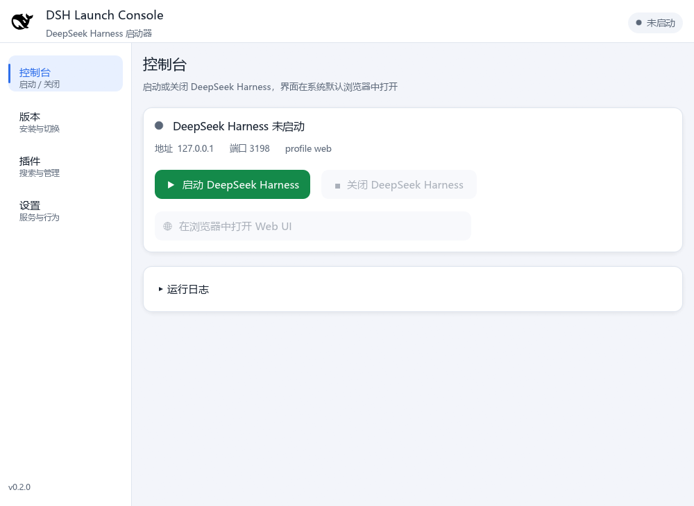
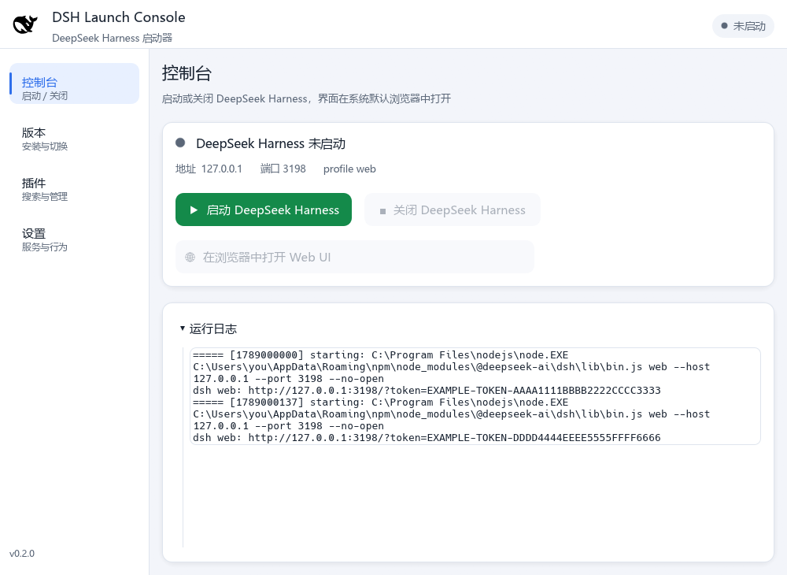
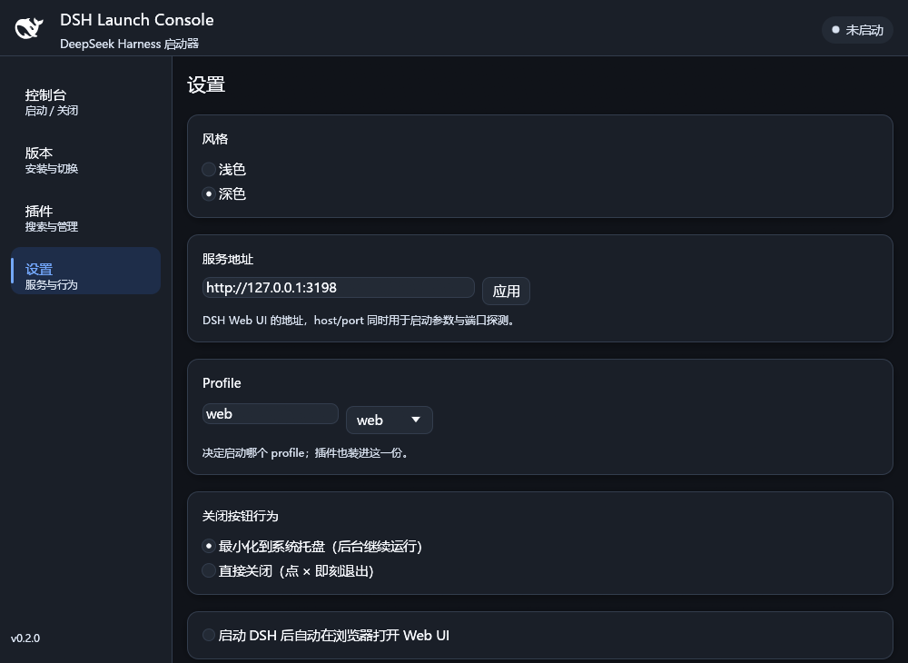

# DSH Launch Console

**DeepSeek Harness（DSH）的图形启动器**：用原生 GUI（Rust + egui，**不依赖 WebView**）
管理 DSH 的启动、关闭、版本与插件，DSH 的 Web UI 交给**系统默认浏览器**承载。
编译产物是**单个可执行文件**，双击即可运行，全程没有终端窗口。

- 只做启动器：界面自己画（OpenGL），不内嵌浏览器、也不需要 WebView2 运行时；
- 隐藏终端启动 DSH，关闭时**整棵进程树**一起结束（含 DSH 拉起的 MCP server 等子进程）；
- 版本与插件都能在界面里管：版本切换 = 切换全局安装，插件走 DSH 自己的 `dsh plugin`。


> 本文截图取自一个隔离的测试实例（端口 3198、独立 `DSH_HOME`）；
> 默认地址是 `http://127.0.0.1:3080`。

同一套源码按目标平台产出两个版本：

| 版本 | 平台 | 说明 |
| --- | --- | --- |
| **Windows 版** | Windows | 隐藏终端启动 DSH；系统托盘常驻；整树清理用命名作业对象（见「它到底做了什么」） |
| **Linux / macOS 版** | Linux、macOS | 隐藏终端启动 DSH；无系统托盘，关窗即退出；整树清理用 `killpg` |

## 与 DeepSeek Harness 的关系

两者是**各自独立**的程序：

- **DSH 本体**：按官网 <https://www.deepseek.com/harness/> 安装，或直接
  `npm i -g @deepseek-ai/dsh`（这就是
  [deepseek-ai/deepseek-harness](https://github.com/deepseek-ai/deepseek-harness) 发布的包）。
- **DSH Launch Console**：只负责「启动 / 关闭 DSH + 在浏览器打开 Web UI + 管版本与插件」。

启动器**不自带 DSH**，它启动的就是你机器上**全局安装**的那一份。如果还没装过：
在「版本」页选一个版本点「安装」，启动器会替你执行 `npm i -g @deepseek-ai/dsh@<版本>`。

## 获取

**方式一：下载安装包（推荐给最终用户）**
到 [Releases](../../releases) 下载 `DSH_Launch_Console-Setup-<版本>.exe`，双击安装。
按用户安装、无需管理员权限。

**方式二：从源码构建（开发者）**
本仓库**只存源码**。clone 后按「构建」一节编译，或直接跑 `安装.bat`（Windows）/
`install.sh`（Linux、macOS）完成「编译 + 安装」一步到位。

> 仓库中不含编译产物与打包产物：`target/`、`DSH_Launch_Console.exe`、`Output/`
> 都被 `.gitignore` 排除，分发包请从 Releases 获取。

## 界面与功能

界面分四页：**控制台 / 版本 / 插件 / 设置**，顶栏右侧是当前状态。

### 控制台

- **专用启动键** `▶ 启动 DeepSeek Harness`：隐藏终端拉起 DSH 服务，就绪后自动
  在系统浏览器打开 Web UI（可在设置里关掉自动打开）。
- **已在运行时再点启动**：只会在浏览器**新开一个 Web UI**（带本次运行的 token，
  直接进界面），**不会**重复启动第二个服务进程。
- **专用关闭键** `■ 关闭 DeepSeek Harness`：结束整棵 DSH 进程树。
- **在浏览器中打开 Web UI**：随时手动打开 / 再开一个标签页。
- **运行日志**：可折叠面板，**支持滚轮与滚动条**翻阅（最多 400 行），
  启动失败时这里就是排查现场。

未启动 / 运行中两种状态：



运行日志可以展开，滚轮或滚动条翻阅上一次运行留下的记录：



> 如果这个 DSH 不是你从启动器里启动的（比如你自己在终端敲 `dsh web` 起的），
> 启动器会识别为「运行中」但**不会去杀它**——为避免误杀，它只结束自己拉起的那棵树，
> 控制台里会有一行黄色说明，关闭键也会置灰。

### 版本

- 自动从 npm registry 检索 `@deepseek-ai/dsh` 的**全部可用版本**与 dist-tag
  （latest / next / alpha）；右上角「源码仓库」按钮可直接打开 GitHub 仓库；
- 选一个版本点「安装 / 切换」——做的事就是 `npm i -g @deepseek-ai/dsh@<版本>`，
  **直接改全局安装**那一份。DSH 只保留一份，没有「启动器自管目录」这种东西；
- 「全局安装」卡片显示当前这份的版本号；没检测到时提示怎么装；
- 列表落盘缓存，下次启动界面秒开、再后台刷新。

> 切换版本会覆盖全局安装里的文件。DSH 正在运行时先关闭它再切，否则 Windows 上
> 可能因文件占用失败（卡片里会有一行提醒）。


### 插件（类 dsh-market）

- **数据源**：社区聚合源 `awesome-dsh-plugin.com`（4000+ 条，含 npm 包名、分类、
  star 数、中英双语描述）+ **GitHub 搜索**（`topic:dsh-plugin`）兜底；
- 按名称 / 作者 / 描述搜索，按分类筛选——界面显示的是**中文分类**
  （界面、主题、趣味、工具、模型、用量、会话、记忆、通知、工作流、Git、文档、语音、视觉、安全、市场），
  对应市场数据里的英文键（ui / theme / fun / tools / model…）；未知分类原样显示，市场加新分类也不会漏；
- **安装 / 卸载**：走 `dsh plugin --profile <profile> add|remove`。该命令由 dsh
  **转发给 pnpm**，所以需要 PATH 上有 `pnpm`（`npm i -g pnpm`）——启动器会先检查并提示；
- **启用 / 禁用**：改写 profile 的 `cordis.patch.yml`（`- id: <插件 id>` +
  `disabled: true/false`），**按行插入、保留原有注释**，改写前留 `.bak`。
  DSH 生成的默认内容是一行 `[]`，启动器会先摘掉它再追加，保证改写后仍是**合法 YAML**
  （否则 DSH 下次启动会读不了 profile）；形态无法安全改写时宁可不写、直接报错；
- **只列你自己装的插件**：DSH 自带 bundle（`@deepseek-ai/dsh-base`、
  `@deepseek-ai/dsh-web-app`）不出现在列表里——它们是 DSH 的一部分，
  补丁里是几十行按行 id 覆盖的子系统，按包名猜一个 id 只会误关系统组件。


### 设置

| 项 | 作用 |
| --- | --- |
| **风格** | 浅色 / 深色，切换立即生效并记住（详见下节） |
| **服务地址** | DSH Web UI 地址，默认 `http://127.0.0.1:3080`。这个 host/port **同时**用于三处：启动参数、端口探测（判断"是否运行中"）、浏览器打开的地址 |
| **Profile** | **可直接输入的下拉框**：左边手输 profile 名，右边下拉给预设（`web` / `desktop` / `自定义`）。输入 `web` 或 `desktop` 就自动落在对应预设上，输入其它任何值即「自定义」——模式完全由输入内容决定，不会出现"输入框和选项框对不上"。决定**启动哪个 profile**，插件也装进同一份 |
| **关闭按钮行为** | 最小化到系统托盘 / 直接关闭（与托盘右键子菜单同步） |
| **自动打开浏览器** | 启动就绪后是否自动打开 Web UI |

几个容易踩的点：

- **服务地址**必须写成 `http://host:port`，省略端口按 3080 处理，**不要带路径**；
  填 `0.0.0.0` 能让 DSH 监听所有网卡，但浏览器打不开 `http://0.0.0.0:3080`，
  局域网访问请手动输 `http://<本机局域网 IP>:3080`；
- 运行中改端口不会自动迁移（探测的是新端口），先「关闭」再改再「启动」；
- **desktop profile 由 Electron 桌面客户端独占**，dsh 命令行会直接拒绝它
  （`profile "desktop" is managed exclusively by the Electron application`），
  启动与插件操作都会失败；
- 自定义一个**不存在**的 profile 时，dsh 会报
  `profile "xxx" does not exist; create it with 'dsh plugin --profile xxx add <package>'`，
  照提示做即可（这条错误会显示在控制台的「启动失败」卡片里）。


### 风格

| 风格 | 说明 |
| --- | --- |
| **浅色**（默认） | 淡灰画布 + 白色卡片 + 淡投影，蓝色主色，状态用柔和的语义色（绿=运行中、橙=启动中、红=失败） |
| **深色** | 深色画布 + 深灰卡片，文字用**近白的高对比色**（主文字 `#f7f9fd`、说明文字 `#d9e2f0`），刻意不用灰字；顶栏鲸鱼图标自动换成白色版本 |

风格由设置决定、**不跟随系统主题**，这样窗口标题栏与内容不会出现一亮一暗的割裂。
深色模式刻意不做"深灰压黑底"：所有说明文字都是高对比的浅色。




### 关闭行为

两种模式在**「设置」页的「关闭按钮行为」**里切换（托盘右键菜单里有同一个开关，
当前生效的那项带勾），**任一种都会连同 DeepSeek Harness 一起关闭**：

| 模式 | 行为 |
| --- | --- |
| **最小化到系统托盘**（默认） | 点 ✕ 只是隐藏窗口，DSH 继续后台运行；托盘图标左键恢复窗口、右键出菜单 |
| **直接关闭** | 点 ✕ 即刻退出，并结束 DSH 进程树 |

托盘右键菜单还提供：显示/隐藏主窗口、启动/关闭 DSH、在浏览器打开 Web UI、
「关闭按钮行为」子菜单、退出（同时关闭 DSH）。

## 它到底做了什么（命令级）

想确认启动器到底动过什么，看这几条就够：

| 动作 | 实际行为 |
| --- | --- |
| **启动** | `node <全局入口>/lib/bin.js <profile> --host <host> --port <port> --no-open`，`CREATE_NO_WINDOW`（Windows）/ 自成进程组（Unix），stdout/stderr 追加到服务日志 |
| **就绪判定** | 轮询 TCP `host:port`，最长 180 秒；期间若进程提前退出，直接把最近 20 行服务日志贴到「启动失败」卡片 |
| **打开浏览器** | 从服务日志里抓本次运行的 token（`dsh web: http://…?token=…`），打开 `http://…/?token=…`；服务端换发签名 cookie 后就都是已登录状态 |
| **关闭** | Windows：命名作业对象 `KILL_ON_JOB_CLOSE`（句柄一关内核清树，启动器崩溃也生效）+ `taskkill /T /F` 兜底；Unix：`killpg`（SIGTERM→500ms→SIGKILL） |
| **单实例** | Windows `CreateMutexW`；Unix 对临时目录里的锁文件 `flock`。已有实例时第二次双击直接退出 |
| **切版本** | `npm i -g @deepseek-ai/dsh@<版本>` |
| **装插件** | `node <全局入口>/lib/bin.js plugin --profile <profile> add/remove <包>`（dsh 转发给 pnpm） |

## 使用

Windows 下双击 **`安装.bat`** 一个入口搞定：

1. **选择安装路径**：弹出文件夹选择框点选，或把目标文件夹**拖拽到 `安装.bat` 上**，
   或命令行 `安装.bat "D:\自定义路径"`。
2. **编译并直接生成到安装目录**：自动执行
   `cargo build --release --target-dir "<安装目录>\target"`（需要 Rust MSVC 工具链，
   首次约几分钟），构建产物全部落在安装目录内，包文件夹保持纯源码。
3. **便携使用**：程序是单文件，`DSH_Launch_Console.exe` 拷到任何地方都能直接运行。
4. **卸载**：安装根目录里的 `uninstall.bat`，或控制面板「应用」。
5. **打包分发**：先双击 `安装.bat` 完成一次编译安装，把安装目录里的
   `DSH_Launch_Console.exe` 复制回本文件夹根目录，然后双击 `package.bat`，
   产出 Windows 安装向导、Windows 源码包、Linux/macOS 源码包。

## Linux / macOS

- **一键安装**：`./install.sh [安装目录]` —— 先选路径（zenity 目录选择框 / 参数指定 /
  手动输入），自动装编译依赖（Debian/Ubuntu 系），
  `cargo build --release --target-dir "<安装目录>/target"`，构建产物全部落在安装目录内；
  自动生成应用菜单启动项与安装目录内的 `uninstall.sh`。
- **打包 .deb**：`./build-linux.sh`。
- 关闭联动：**关窗即退出并结束由本程序启动的 DSH**（`killpg`，SIGTERM→SIGKILL）。
  启动器崩溃时 DSH 可能残留（Windows 上不会——作业对象会连带清掉），
  下次启动会按端口状态把它识别为「外部实例」：只打开浏览器，不接管、也不去杀它。
- **系统托盘是 Windows 版特性**：Linux/macOS 版关闭按钮直接退出。

## 构建

```bat
:: 双击 安装.bat（自动编译 + 安装），或只想编译时手动：
cd /d <本文件夹>
cargo build --release
:: 产物: target\release\dsh-launch-console.exe
::（编译期已嵌入鲸鱼图标；复制为 DSH_Launch_Console.exe 即可便携运行）
```

- 需要 **Rust 工具链**（Windows 用 MSVC；Linux/macOS 用系统默认）。
- Linux 还需要 X11/Wayland 开发头与 OpenGL（`install.sh` / `build-linux.sh` 会自动装
  Debian/Ubuntu 系依赖）。
- 渲染后端是 **glow（OpenGL）**，不是 wgpu：界面简单、依赖更少、启动更快。
- 打包 Windows 安装向导需要 Inno Setup（`package.bat` 会去找 `iscc`，
  或便携版 `..\.innosetup\ISCC.exe`）。

## 开发与测试

```bash
# 单元测试：URL/token 解析、版本排序、插件启停改写（含 YAML 合法性回归）等
cargo test
```

**端到端自检**（用独立端口 + 独立 `DSH_HOME`，不碰你正在用的会话）：

```bat
set DSH_LAUNCH_CONSOLE_URL=http://127.0.0.1:3199
set DSH_HOME=%TEMP%\dsh-selftest-home
:: 本程序是 GUI 子系统（不带黑框），cmd/PowerShell 不会等它，所以显式等待：
start /wait DSH_Launch_Console.exe --selftest
echo 退出码 %ERRORLEVEL%
```

依次验证：node 可用 → 解析到全局安装 → 隐藏终端启动并就绪 → 从服务日志解析出本次
token 且带 token 访问返回 2xx/3xx → 整树关闭后端口释放。`--diagnose` 是同义入口，
失败时退出码为 1。（PowerShell 里用 `Start-Process -Wait -PassThru`。）

`tests/` 目录下另有一组 Windows 实机验证脚本，用法与实测结论见
[`tests/README.md`](tests/README.md)——注意其中有几支是 0.1.0 WebView 时代留下的，
该文件表格里标了适用版本。

## 源码结构

```
src/
  main.rs       入口：--selftest 分流 → 单实例闸门 → eframe 启动
  app.rs        界面全部：四页布局、状态机、后台任务通道、主题与调色板
  config.rs     路径、HTTP 客户端（带超时）、URL 解析、日志
  dsh.rs        DSH 生命周期：入口解析、隐藏启动、token 解析、整树关闭
  webui.rs      系统浏览器打开 + 端口探测 + 带 token 的地址构造
  versions.rs   npm 版本检索 / 缓存 / 全局安装（npm i -g）
  plugins.rs    插件市场、GitHub 搜索、已装列表、cordis.patch.yml 启停改写
  settings.rs   持久化设置（含风格、Profile）
  tray.rs       Windows 系统托盘与右键子菜单；其他平台为空实现
  winproc.rs    Windows 专用：作业对象整树清理、进程存活探测
  procs.rs      子进程助手：统一隐藏终端窗口
  icon.rs       鲸鱼图标（编译期嵌入）+ 运行期加载系统中文字体
  selftest.rs   --selftest / --diagnose 的端到端自检
```

界面部分集中在 `app.rs`；每个模块顶部都有中文注释说明它负责什么、以及踩过的坑。

## 环境变量（可选，高级用途）

| 变量 | 说明 |
| --- | --- |
| `DSH_LAUNCH_CONSOLE_URL` | 覆盖服务地址（优先级高于设置文件，界面也认），便于用独立端口起测试实例 |
| `DSH_LAUNCH_CONSOLE_NODE` | 指定 node 可执行文件 |
| `DSH_LAUNCH_CONSOLE_MUTEX` | 单实例互斥体名（并存多套配置/测试实例用） |
| `DSH_HOME` | 覆盖 DSH 主目录（profile / 插件），默认 `%USERPROFILE%\.dsh` |
| `DSH_LAUNCH_CONSOLE_PROFILE` | 仅自检用：指定自检启动的 profile |

## 日志与路径

**启动器不创建任何目录。** 它只往系统临时目录里写几个小文件：

| 内容 | 位置 |
| --- | --- |
| 启动器日志 | `%TEMP%\DSH-Launch-Console.log` |
| DSH 服务输出（含 token） | `%TEMP%\DSH-Launch-Console-server.log` |
| 启动器设置 | `%TEMP%\DSH-Launch-Console-settings.json` |
| 版本列表缓存 | `%TEMP%\DSH-Launch-Console-versions.json` |

（Linux/macOS 上就是 `$TMPDIR` 或 `/tmp`。0.2.0 起不再使用
`%LOCALAPPDATA%\DSH-Launch-Console`，那个目录不会再被创建。）

DSH 自己的目录（profile / 插件 / 会话）仍在其主目录 `%USERPROFILE%\.dsh`
（`DSH_HOME` 可覆盖）——那是 DSH 的地盘，与启动器无关。

## Windows 版工具说明（重要）

`bash` 类工具在 Windows 上执行时需要 DSH 会话的**完全访问权限**，否则会被沙箱拦截：

- 系统默认 `bash`（WSL 启动器）：WSL 未安装发行版时报
  `Wsl/EnumerateDistros/Service/E_ACCESSDENIED`；
- Git Bash（`C:\Program Files\Git\bin\bash.exe`）：受限沙箱禁止命名管道，
  报 `couldn't create signal pipe, Win32 error 5`；
- stock `minimal` / `standard` 预设的持久 bash 依赖仅支持 linux/darwin 的 PTY 后端，
  在 win32 上会报 `terminal inspection is unsupported on platform win32`。

**解决方式**：在 DSH 的权限设置里把会话权限预设设为 **danger-full-access（完全访问）**，
之后 `bash` 可直接执行；保持受限模式时，每次调用都会弹出一次「升级到完全访问」的审批。

## 中文字体

界面中文**运行期从系统字体加载**（不内嵌，否则安装包体积翻十倍）：

- Windows：微软雅黑 → Noto Sans SC → 等线 → 黑体
- Linux：Noto Sans CJK SC → 思源黑体 → 文泉驿（经 `fc-match` 查询）
- macOS：苹方 → 冬青黑体

一个都找不到时回退到 egui 默认字体（中文显示为方块）。实际加载到哪个字体，
会写进启动器日志。

## 常见问题

- **点了启动但浏览器没打开**：先在「控制台」看状态；若为「启动失败」，
  下方「运行日志」里有原因（可滚动查看）。
- **浏览器里显示 401**：说明 cookie 尚未建立。让启动器**自己启动一次** DSH
  （点「关闭」再点「启动」），它会用服务日志里本次运行的 token 打开界面。
- **关闭窗口后 DSH 还在**：当前是「最小化到系统托盘」模式。想真正退出请右键托盘图标
  选「退出」，或在「设置」里把「关闭按钮行为」改成「直接关闭」。
- **「关闭 DeepSeek Harness」点了没反应 / 是灰的**：这个 DSH 不是你从启动器启动的
  （例如终端里敲 `dsh web` 起的）。为避免误杀，启动器只结束自己拉起的那棵进程树。
- **插件装了但没生效**：DSH 需要重启才会加载新插件；另外确认它在「插件」页处于
  **已启用**状态（禁用会写进 `cordis.patch.yml`）。
- **插件装不上，提示找不到 pnpm**：`dsh plugin` 是转发给 pnpm 的，
  执行 `npm i -g pnpm` 后重试。
- **切换版本后行为没变**：切换改的是全局安装那一份，正在运行的 DSH 仍是旧代码——
  关闭再启动一次；并确认「版本」页「全局安装」卡片显示的是你要的版本。
- **提示「未找到 DeepSeek Harness 的全局安装」**：npm 全局前缀不在启动器检测范围内
  （`%APPDATA%\npm`、`%ProgramFiles%\nodejs`、pnpm 全局目录）。可在「版本」页点某个
  版本的「安装」让 npm 重装一次，或用 `npm prefix -g` 核对。
- **换 Profile 后插件列表空了**：插件是按 profile 隔离的，换一份自然看到的是那一份的插件。
- **双击没有出现新窗口**：单实例设计——已有实例在运行时会直接退出。
- **界面中文显示为方块**：系统缺少中文字体，见上文「中文字体」。

## 许可证

[MIT](LICENSE)
