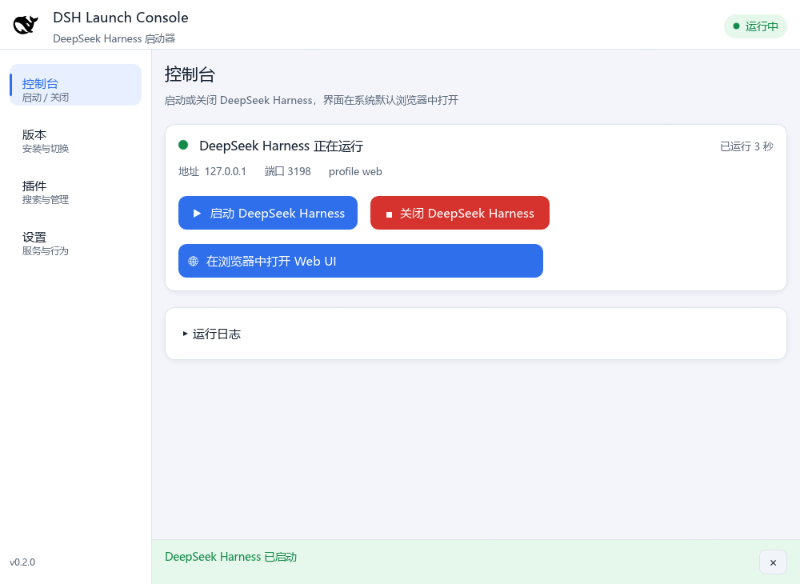
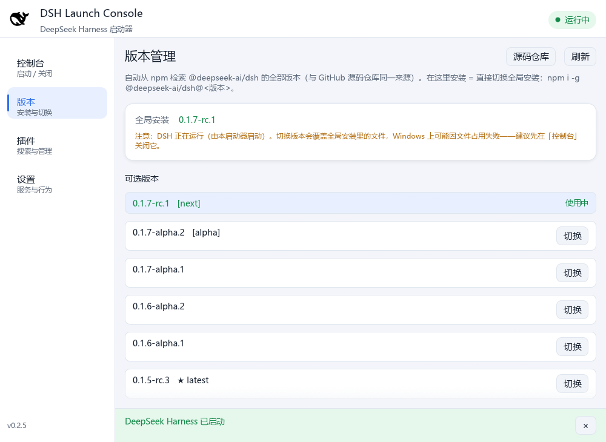
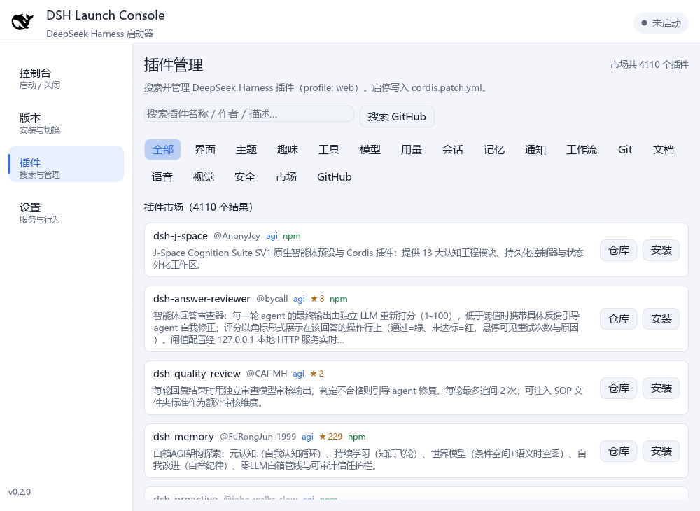
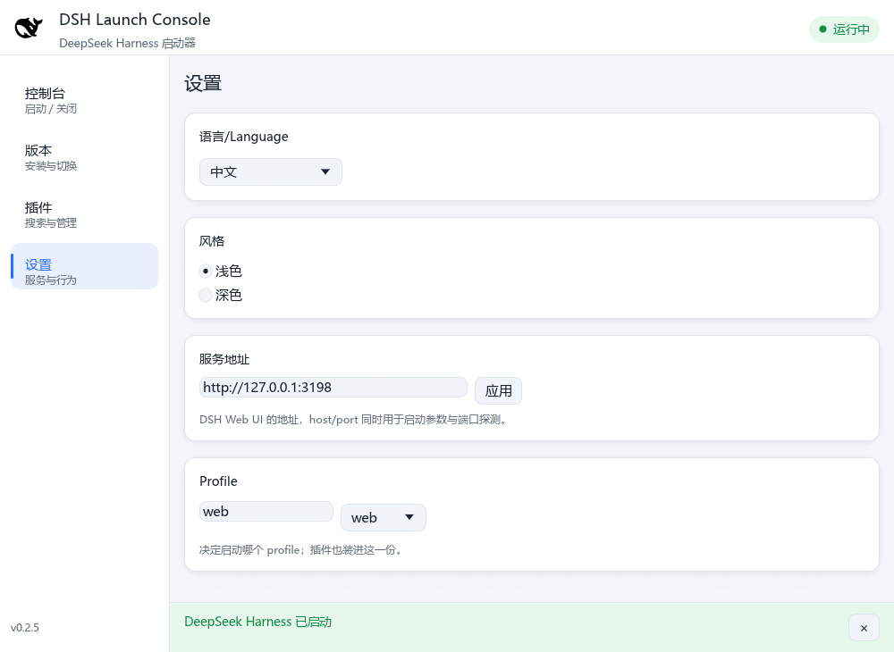
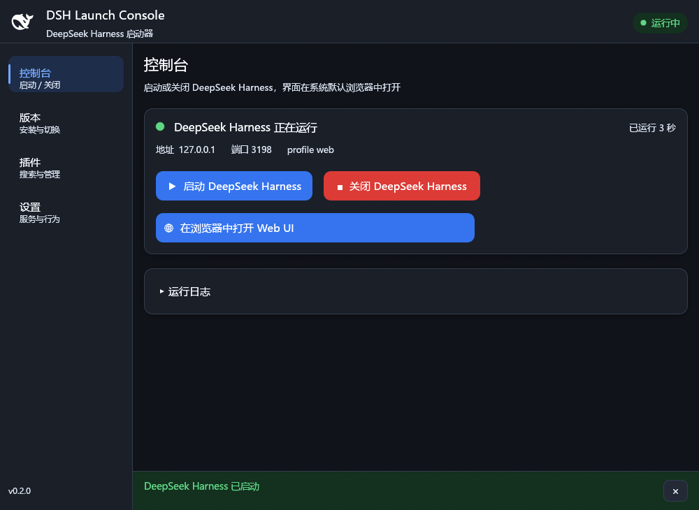

# DSH Launch Console

**DeepSeek Harness（DSH）的图形启动器**：用原生 GUI（Rust + egui，**不依赖 WebView**）
管理 DSH 的启动、关闭、版本与插件，Web UI 交给**系统默认浏览器**打开。
单个可执行文件，双击即用，全程没有终端窗口。



## 与 DSH 的关系

两者各自独立安装：

- **DSH 本体**：`npm i -g @deepseek-ai/dsh`，或官网 <https://www.deepseek.com/harness/> 的安装包。
- **本程序**：只负责启动 / 关闭 DSH、在浏览器打开 Web UI、管版本与插件，**不自带 DSH**。
  没装过也没关系——在「版本」页点「安装」，它会替你执行 `npm i -g`。

## 获取

- **安装包**：Releases 里的 `DSH_Launch_Console-Setup-<版本>.exe`，双击安装（按用户安装，无需管理员）。
- **源码**：clone 后跑 `安装.bat`（Windows）或 `./install.sh`（Linux、macOS），编译 + 安装一步到位。

## 功能

| 页面 | 说明 |
| --- | --- |
| **控制台** | `▶ 启动` / `■ 关闭` DSH；已在运行时再点「启动」只会**在浏览器新开一个 Web UI**，不会重复起服务；运行日志可滚动翻阅 |
| **版本** | 列出 npm 上 `@deepseek-ai/dsh` 的全部版本与 dist-tag；「安装 / 切换」= `npm i -g @deepseek-ai/dsh@<版本>` |
| **插件** | 插件市场（4000+，分类显示中文）+ GitHub 搜索；安装 / 卸载 / 启用 / 禁用 |
| **设置** | 风格（浅色 / 深色）、服务地址、Profile、关闭按钮行为、启动后自动打开浏览器 |

**关闭行为**：点 ✕ 可选「最小化到系统托盘」或「直接关闭」，两种都会在退出时**连同 DSH 一起关闭**。
托盘右键菜单：显示/隐藏窗口、启动/关闭 DSH、打开 Web UI、关闭按钮行为（当前项带勾）、退出。

## 界面







深色主题在「设置 → 风格」里切换，立即生效并记住（文字用高对比浅色，不糊）：



## 使用

Windows 下双击 **`安装.bat`**：选安装路径（或 `安装.bat "D:\自定义路径"`），
自动执行 `cargo build --release --target-dir "<安装目录>\target"` 并把
`DSH_Launch_Console.exe` 生成到安装目录；卸载用安装目录里的 `uninstall.bat`。
打包分发：先编译一次，再把 exe 复制到源码根目录，双击 `package.bat`
（产出 Windows 安装向导 + Windows / Linux 源码包）。

Linux / macOS：`./install.sh [安装目录]`；打包 .deb 用 `./build-linux.sh`。

## 构建

```bat
cargo build --release
:: 产物 target\release\dsh-launch-console.exe（已内嵌鲸鱼图标，复制为 DSH_Launch_Console.exe 即可便携运行）
```

需要 Rust 工具链（Windows 用 MSVC）；Linux 另需 X11/Wayland 开发头与 OpenGL
（`install.sh` / `build-linux.sh` 会自动装 Debian/Ubuntu 系依赖）。

## 开发与测试

```bash
cargo test        # 单元测试：URL / token 解析、版本排序、插件启停改写（含 YAML 合法性回归）等
```

端到端自检（独立端口 + 独立 `DSH_HOME`，不碰你正在用的会话；`--diagnose` 同义）：

```bat
set DSH_LAUNCH_CONSOLE_URL=http://127.0.0.1:3199
set DSH_HOME=%TEMP%\dsh-selftest-home
start /wait DSH_Launch_Console.exe --selftest
echo 退出码 %ERRORLEVEL%
```

## 环境变量与文件位置

| 变量 | 说明 |
| --- | --- |
| `DSH_LAUNCH_CONSOLE_URL` | 覆盖服务地址（优先级高于设置文件，便于用独立端口起测试实例） |
| `DSH_LAUNCH_CONSOLE_NODE` | 指定 node 可执行文件 |
| `DSH_LAUNCH_CONSOLE_MUTEX` | 单实例互斥体名（并存多套配置 / 测试实例用） |
| `DSH_HOME` | DSH 主目录（profile / 插件），默认 `%USERPROFILE%\.dsh` |

**启动器不创建任何目录**，只往系统临时目录写几个小文件：
`DSH-Launch-Console.log`（启动器日志）、`DSH-Launch-Console-server.log`（DSH 输出，含 token）、
`DSH-Launch-Console-settings.json`（设置）、`DSH-Launch-Console-versions.json`（版本列表缓存）。

## 常见问题

- **浏览器里显示 401**：cookie 尚未建立。让启动器**自己启动一次** DSH（点「关闭」再「启动」），
  它会用本次运行的 token 打开界面。
- **关窗后 DSH 还在**：当前是「最小化到系统托盘」模式。想真正退出请右键托盘图标选「退出」，
  或把「关闭按钮行为」改成「直接关闭」。
- **「关闭 DeepSeek Harness」是灰的**：这个 DSH 不是你从启动器启动的（比如终端里敲 `dsh web` 起的）。
  为避免误杀，启动器只结束自己拉起的那棵进程树。
- **插件装不上，提示找不到 pnpm**：`dsh plugin` 是转发给 pnpm 的，先 `npm i -g pnpm`。
- **切换版本后行为没变**：切换改的是全局安装那一份，正在运行的 DSH 仍是旧代码——关闭再启动一次。
- **双击没有出现新窗口**：单实例设计，已有实例在运行时会直接退出。
- **界面中文显示为方块**：系统缺少中文字体（Windows 一般自带微软雅黑，不会遇到）。

## 许可证

[MIT](LICENSE)
