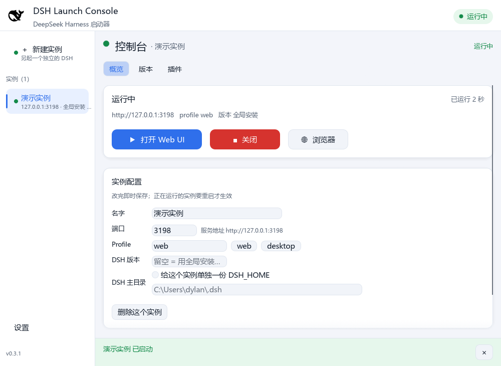
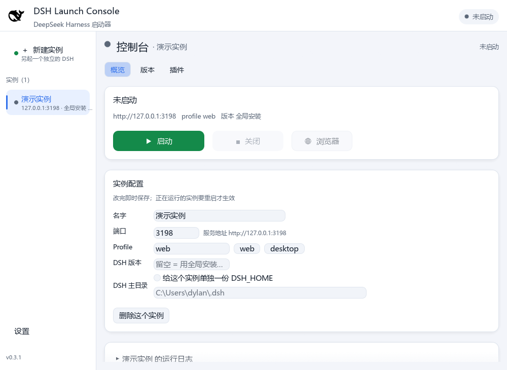
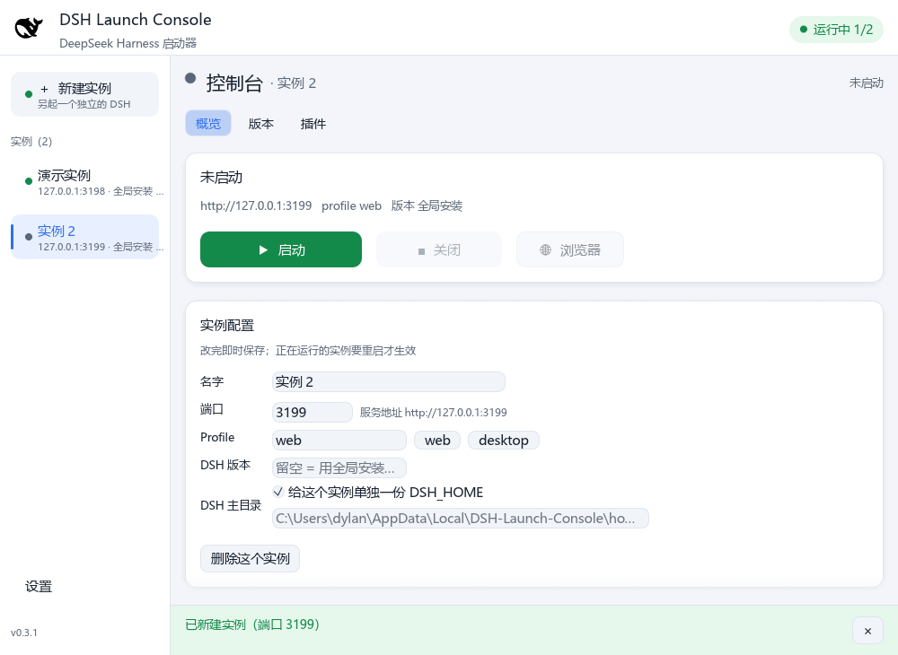
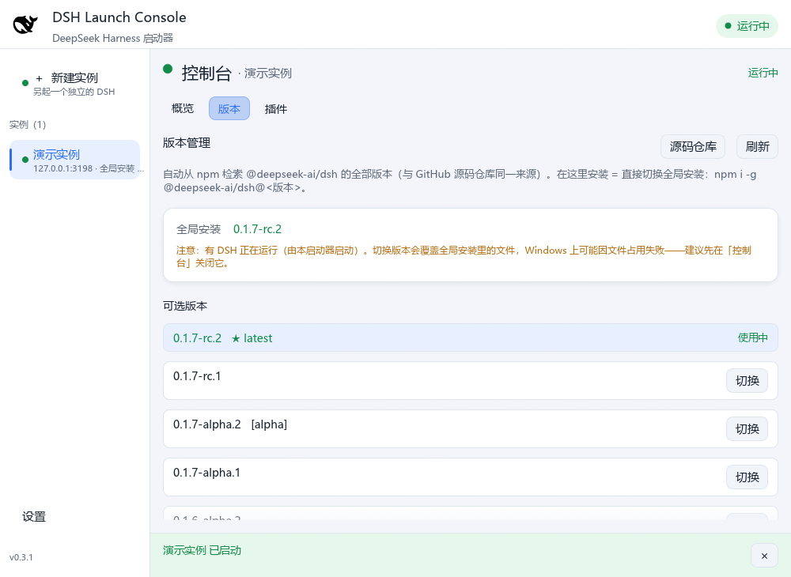
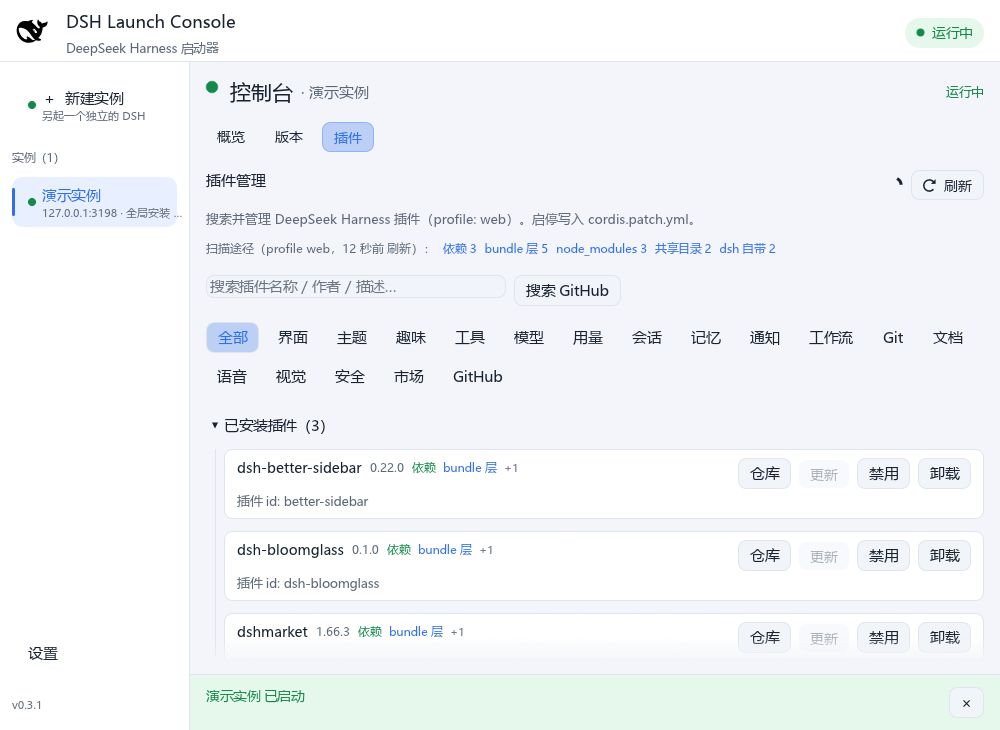
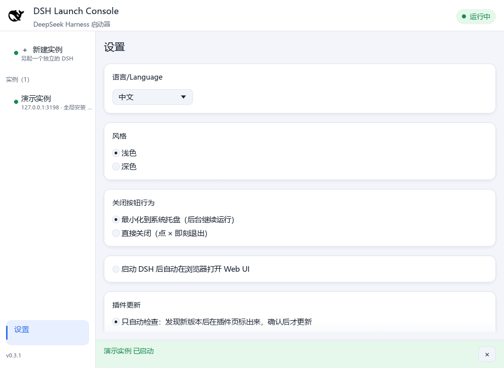
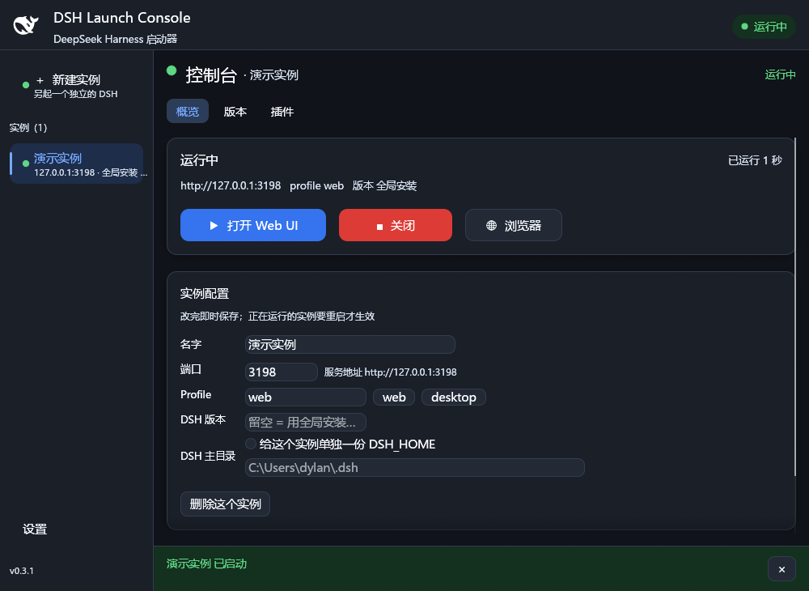

# DSH Launch Console

**DeepSeek Harness（DSH）的图形启动器**：用原生 GUI（Rust + egui，**不依赖 WebView**）
管理 DSH 的启动、关闭、版本与插件，Web UI 交给**系统默认浏览器**打开。
单个可执行文件，双击即用，全程没有终端窗口。



## 与 DSH 的关系

两者各自独立安装：

- **DSH 本体**：`npm i -g @deepseek-ai/dsh`，或官网 <https://www.deepseek.com/harness/> 的安装包。
- **本程序**：只负责启动 / 关闭 DSH、在浏览器打开 Web UI、管版本与插件，**不自带 DSH**。
  没装过也没关系——在「版本」页点「安装」，它会替你执行 `npm i -g`。

## 下载安装

**[⬇ 下载 DSH_Launch_Console-Setup-0.3.1.exe](https://github.com/CosmoSail/DSH_Launch_Console/releases/latest)**（Windows，5 MB）

双击安装即可 —— 按用户安装、**无需管理员权限**，带开始菜单与可选桌面快捷方式，可在「应用」里卸载。
需要 **Node.js ≥ 18**；DSH 本体没装过也没关系，装好后在「版本」页点「安装」会自动替你装。

也可以从 [Releases](https://github.com/CosmoSail/DSH_Launch_Console/releases) 拿源码包自行编译
（每个文件旁边附有 SHA-256；自己打包时校验和由 `package.bat` 自动写到 `Output\SHA256SUMS.txt`）。
历史版本的改动说明也都在那里，本文件只描述当前版本：

| 文件 | 适用 | 用法 |
| --- | --- | --- |
| `DSH_Launch_Console-Setup-0.3.1.exe` | Windows | 双击安装（推荐） |
| `DSH_Launch_Console-0.3.1-windows-src.zip` | Windows | 解压后双击 `安装.bat` 自行编译安装 |
| `DSH_Launch_Console-0.3.1-linux.tar.gz` | Linux / macOS | 解压后 `./install.sh`，或 `./build-linux.sh` 打 .deb |

> 界面是原生 OpenGL 渲染，**不需要 WebView2 运行时**。

## 界面结构

**左侧栏**：

| 位置 | 内容 |
| --- | --- |
| 顶部 | **全局实例**——固定存在、不可删。它单独拎出来放在最上面，因为它是全局那一份的代表，不是"又一个实例" |
| 其下 | **＋ 新建实例** |
| 再下 | **其它实例（N）**：自己建的实例列表。每一项显示名字、`host:端口 · 版本 · 状态`，左侧圆点用颜色表示跑没跑（绿=运行中 / 黄=启动中 / 红=失败 / 灰=未启动）。实例多了这一块自己滚动 |
| 最下方 | **设置**（版本号在最底）：语言、风格、关闭按钮行为、自动开浏览器、插件更新策略——整个程序一份 |

> 版本那一栏显示的是**具体版本号**（如 `0.1.7-rc.2（全局）`），不是"全局安装"四个字——
> 想知道"我跑的是哪一版"时，这四个字帮不上忙。括号里标出这份是从全局安装来的。

### 全局实例

侧栏第一条 **全局实例**是固定的：

- 用**全局安装**的那份 DSH（`npm i -g @deepseek-ai/dsh`，也就是命令行 `dsh` 用的同一份）
- 用**默认 DSH 主目录** `~/.dsh`
- **不能删除、不能改版本、不能改名字**；端口可以改（那是"怎么访问它"，不是"它是谁"）

它不是一个"碰巧这么配的普通实例"——语义上就代表全局那一份，所以启动器每次加载设置都会把这几个字段掰回固定值（设置文件是可以手工编辑的，不能让"全局"名不副实）。

**其余实例与全局、以及彼此之间完全隔离**：

| 隔离项 | 怎么隔离 |
| --- | --- |
| DSH 版本 | **每个自建实例各装各的**（`instances\<id>\versions\<版本>`），跟全局安装、跟别的实例都无关。全局那一份只给全局实例用 |
| DSH 主目录 | 各自一份 `instances\<id>\home`，profile、插件、登录凭据都不共用 |
| 端口 | 各占各的，新建时自动避开已用的 |
| 服务日志 / token | 各写各的，不会拿错 token |
| 增删 | 新建、删除**只影响自己**；删除会把自己那一整个目录（数据 + 自装版本）一起清掉，不碰全局实例、也不碰别的实例 |

> 新建实例会自动选一个版本（npm 上的 `latest`），生来就带版本号，不用手动挑。
> 没装过的版本会在「版本」页显示成「安装新版本」，点那一行的「安装」即可（装完自动切过去并启动）。

**右侧主区**显示选中实例的 **控制台**——一个实例的全部东西都在这一页，用分段切换：

| 分段 | 内容 |
| --- | --- |
| **概览** | 状态与「启动 / 关闭 / 浏览器」；**实例配置**（名字、端口、profile、DSH 主目录、删除实例）；该实例的运行日志。版本在这里**只显示**，改它去「版本」分段 |
| **版本** | **全局实例与自建实例是两套不同的页面**，见下 |
| **插件** | 插件市场（4000+，分类显示中文）+ GitHub 搜索；安装 / 卸载 / 更新 / 启用 / 禁用；已装插件可一键打开项目仓库 |

**「版本」分段按实例类型分成两套**——两者管的是完全不同的东西，混在一起最容易误解：

| 选中 | 这一页管什么 | 能做什么 |
| --- | --- | --- |
| **全局实例** | **全局安装**那一份 DSH（`%APPDATA%\npm\...\@deepseek-ai\dsh`） | 选一个**切换**全局安装（命令行 `dsh`、自检也跟着变）；当前那一版可以**卸载**（卸载后全局实例没得跑，直到重装一个）。**不能**给全局实例选版本——它固定用全局那份 |
| **自建实例** | **这个实例**用哪一份 | 「已装到自管目录」那组：点「使用」就切过去，也可以「卸载」不需要的那几份；「安装新版本」那组点「安装」，装完自动切过去并启动。**不碰全局安装**，也不影响别的实例 |

所以：**全局实例只管理全局版本，自建实例只管理自己的版本。** 自建实例的页面里不会出现
「全局安装」这个选项，全局实例的页面里也不会出现自管目录的版本选择——各管各的，没有交叉。

**卸载**都走确认（会说明删什么、以及后果）：

* 全局实例页 → 卸载全局安装：`npm uninstall -g @deepseek-ai/dsh`。**所有自建实例不受影响**，
  但全局实例、命令行 `dsh`、自检都没得跑，直到重新装一个。
* 自建实例页 → 卸载某个版本：只删 `<数据目录>\instances\<id>\versions\<版本>` 这一份，
  不动它的 DSH 主目录、不动别的实例。若卸载的正是它在用的那个，版本号会被清空，
  界面会引导去装一个（而不是留一个指向空目录的版本号）。

**实例配置**里能填的字段：

| 字段 | 怎么填 |
| --- | --- |
| **Profile** | 输入框 + **预设下拉框**（`web` / `desktop` / 自定义）。选预设即填入，选「自定义」清空输入框等你敲——手输与下拉永远一致 |
| **DSH 版本** | 只读显示**当前实际用的具体版本号**（如 `0.1.7-rc.2（全局）`），旁边「改版本 →」跳到「版本」分段去选。**选版本只在这一处**，免得两个地方各说各话。全局实例显示「（固定）」——它不能改版本 |
| **DSH 主目录** | 开关「给这个实例单独一份 DSH_HOME」，或直接填一个自定义路径。全局实例固定显示 `~/.dsh`，不给改 |

所以「服务地址、profile、版本管理、插件管理」都在实例的控制台里——它们本来就是
**某个实例的属性**。启动器级别的偏好只有侧栏最下方那一页。

## 多实例

侧栏管理的是一**组**实例：固定的**全局实例** + 任意多个新建实例。每个实例有自己的端口、
profile、DSH 主目录与 DSH 版本，**可以同时运行、互不干扰**。

- **新建 / 删除**：侧栏的「＋ 新建实例」；端口自动挑一个没被自己占用的。
  切换实例 = 点侧栏里那一项（版本页与插件页跟着它走）。
  删除在实例控制台的「概览 → 实例配置」里，会先关掉它（只结束本启动器拉起的那棵树），
  然后**把它的一整个目录删掉**。
  **全局实例没有删除按钮**；其余实例可以随便增删，**完全互不影响**。
- **删实例会连数据一起清掉**（不可逆，所以点删除会先弹一次确认，确认框里写明要删的路径）：
  删掉 `<数据目录>\instances\<id>` 这**一整个目录**——它的 DSH 主目录（profile、插件、
  登录凭据）与它自己装的 DSH 版本都在里面。这也是把这两样收进同一个目录的原因：
  删实例就是一次目录删除，不必去猜"哪个版本还有别人在用"。
  万一删不掉（比如实例还在跑、Windows 上文件被占用），**配置也不会删**并会报错——
  不会出现"界面说删了、磁盘上还留着几百 MB"这种找不到主的情况。
- **每实例独立插件目录**（默认开）：这个实例有自己的 `<数据目录>\instances\<id>\home`
  作为 DSH 主目录，profile 与插件都在里面。关掉则与其它实例共用 `~/.dsh`——
  想几个实例共享同一套插件时才关（共用时插件管理命令会互相影响）。
- **每实例自带版本，且版本文件也各存各的**：新建时自动选一个版本（npm 上的 `latest`）。
  在「版本」分段可以换：**已装到自管目录**那组点「使用」就切过去；**安装新版本**那组点「安装」，装完
  自动切过去并启动。版本装在 `<数据目录>\instances\<id>\versions\<版本>`，
  **自建实例之间不共用版本文件**——代价是同一个版本被两个实例用到时会各存一份
  （每个约 300–450 MB），换来的是删实例能干净利落地把它带的那份版本一起删掉。
  全程**不碰全局安装**（那是全局实例专用的）。自建实例**不能**选「全局安装」：
  那会回落到全局那份代码、却仍用自己的数据目录，这种"半隔离"最容易让人误判。
  安装期间「启动」是灰的，避免 npm 还没写完就把进程拉起来。
- **互不混淆的 token**：每个实例写自己的服务日志，token 从各自那份里解析——
  否则用别人的 token 去开自己的界面只会得到 401。

数据目录（**唯一会主动创建目录的地方**）：

| 路径 | 用途 |
| --- | --- |
| `<数据目录>\instances\<实例 id>\home` | 该实例的 DSH_HOME（profile / 插件 / 凭据）。全局实例不用这里，它用 `~/.dsh` |
| `<数据目录>\instances\<实例 id>\versions\<版本>` | 该实例自己装的 DSH 版本（各实例不共用） |

删掉某个实例 = 删掉它那一整个 `instances\<id>` 目录，两边一起清掉。
Windows 下 `<数据目录>` 是 `%LOCALAPPDATA%\DSH-Launch-Console`，Linux 是
`~/.local/share/DSH-Launch-Console`。新建实例全关掉「独立插件目录」、并且不带版本号时，
整个数据目录都不会被创建。

> 从 0.2.5 及更早升级上来时，原来的「服务地址 + profile」会自动变成**全局实例**
> （端口、profile 与升级前一致，用全局安装与默认 `~/.dsh`），行为不变。

## 功能

| 位置 | 说明 |
| --- | --- |
| **控制台（某个实例）** | 「启动 / 关闭 / 浏览器」；实例配置（名字 / 端口 / profile / DSH 主目录）；运行日志。已在运行时再点「启动」只会**在浏览器新开一个 Web UI**，不会重复起服务 |
| **控制台 → 版本** | **按实例类型分成两套**：全局实例页管**全局安装**（切换 / 卸载那一份）；自建实例页管**这个实例自己装的版本**（使用 / 卸载 / 安装新版本）。详见上面「界面结构」 |
| **控制台 → 插件** | 插件市场 + GitHub 搜索；安装 / 卸载 / **更新** / 启用 / 禁用；**已装插件可一键打开它的项目仓库**；「刷新」重扫全部安装途径**并重查最新版本**；已装列表一屏 4 行，多了用滚轮或拖滚动条翻。**操作的是当前选中的实例** |
| **设置** | **语言（中文 / English）**、风格（浅色 / 深色）、关闭按钮行为、启动后自动打开浏览器、**插件更新策略**（只检查待确认 / 自动更新） |

**插件来源**：插件页的「刷新」会把下面这些途径一次扫完，并在包名后标出命中的途径（悬停看解释）：

| 途径 | 含义 |
| --- | --- |
| `依赖` | 登记在 profile 的 `package.json` dependencies 里（`dsh plugin add` / pnpm add） |
| `bundle 层` | 被选进 profile 的 `dsh.profile.bundles`，会加载进 boot graph |
| `node_modules` / `pnpm 存储` / `兜底目录` | 磁盘上确实存在、但没写进 manifest 的插件（手工拷贝、别的工具装的） |
| `共享目录` | `<DSH_HOME>/profiles/node_modules` 这类多 profile 共用的目录 |
| `dsh 自带` | 全局 dsh 安装的平台层，不是用户装的——只计入途径统计，**不在列表里显示** |

启停写的是插件包**自己** `cordis.patch.yml` 里 `insert` 的那些 id；一个包 insert 多行时会一起改
（避免只关掉半个插件）。传递依赖（如 `js-yaml`）不会被误列成插件。

**打开插件仓库**：已装插件那一行的「仓库」按钮会在系统浏览器里打开它的项目地址——
取自插件包自己 `package.json` 的 `repository` / `homepage`（`git+https://…git`、`git@host:owner/repo`
这些写法都会归一化成可直接打开的 https 地址）；包没写仓库字段时，npm 装的插件回落到它的
npm 页面。GitHub / 本地路径装的包没有可靠的仓库地址，这时不显示这个按钮——宁可不给，
也不给一个点了打不开的死链。

例如装在本地的三个插件，按钮分别打开：

| 插件 | 「仓库」打开 |
| --- | --- |
| `dsh-bloom-theme` | `https://github.com/webkubor/dsh-bloom-theme` |
| `dsh-frosted-window` | `https://github.com/SenryLee/dsh-frosted-window` |
| `dshmarket` | `https://github.com/dsh-market/dsh-market` |

**关闭行为**：点 ✕ 可选「最小化到系统托盘」或「直接关闭」，两种都会在退出时**连同 DSH 一起关闭**。
托盘右键菜单：显示/隐藏窗口、启动/关闭 DSH、打开 Web UI、关闭按钮行为（当前项带勾）、退出。

## 界面

控制台 · 概览（实例的状态、启停与全部配置都在这一页）：



多实例：侧栏列出所有实例，右侧显示选中那个的控制台——上面两张就是两个实例各自的状态。



控制台 · 版本 与 控制台 · 插件（都是同一个实例的分段）：





设置（整个程序一份）：



深色主题在「设置 → 风格」里切换，立即生效并记住（文字用高对比浅色，不糊）：



## 使用

Windows 下双击 **`安装.bat`**：选安装路径（或 `安装.bat "D:\自定义路径"`），
自动执行 `cargo build --release --target-dir "<安装目录>\target"` 并把
`DSH_Launch_Console.exe` 生成到安装目录；卸载用安装目录里的 `uninstall.bat`。
打包分发：先编译一次，再把 exe 复制到源码根目录，双击 `package.bat`
（产出 Windows 安装向导 + Windows / Linux 源码包）。`package.bat` 的源码包两步
由明文的 `make-archives.ps1` 完成，可单独跑：`pwsh -File make-archives.ps1 -Only linux`。

Linux / macOS：`./install.sh [安装目录]`；打包 .deb 用 `./build-linux.sh`。

## 构建

```bat
cargo build --release
:: 产物 target\release\dsh-launch-console.exe（已内嵌鲸鱼图标，复制为 DSH_Launch_Console.exe 即可便携运行）
```

开发时更推荐用工作区里的 **`pwsh -File .dev\rebuild.ps1`**：除了编译与单元测试，
它还会把产物**同步到仓库根那份 `DSH_Launch_Console.exe`**。

> ⚠️ 仓库根的 `DSH_Launch_Console.exe` 就是"双击即用"的那份，它**不会**随
> `cargo build` 自动更新。只跑 `cargo build` 的话，你双击的仍是很久以前的旧界面
> ——而且完全看不出来。`rebuild.ps1` 会顺手同步，被占用（正开着它）时会明确提示
> "仍是旧版，关掉后再跑一次"。安装包也会打包这份 exe，所以打包前务必让它是最新的。

需要 Rust 工具链（Windows 用 MSVC）；Linux 另需 X11/Wayland 开发头与 OpenGL
（`install.sh` / `build-linux.sh` 会自动装 Debian/Ubuntu 系依赖）。

**版本号只写一处**：项目根 `Cargo.toml` 的 `version`。exe 的「属性 → 详细信息」由
`build.rs` 在编译期从 cargo 注入的版本号生成，安装向导的版本由打包脚本读出后用
`ISCC /DMyAppVersion=` 传入，`安装.bat` 的卸载条目、`build-linux.sh` 的 .deb 版本号
也都在运行时读 `Cargo.toml`——改了 `Cargo.toml` 一处，exe 属性、界面侧栏、安装器
与 .deb 的版本号一起跟上，不会互相漂移。

## 开发与测试

```bash
cargo test        # 单元测试：URL / token 解析、版本排序、插件启停改写（含 YAML 合法性回归）等
```

端到端自检（独立端口 + 独立 `DSH_HOME`，不碰你正在用的会话；`--diagnose` 同义）：

```bat
set DSH_LAUNCH_CONSOLE_URL=http://127.0.0.1:3199
set DSH_HOME=%TEMP%\dsh-selftest-home
start /wait DSH_Launch_Console.exe --selftest
echo 退出码 %ERRORLEVEL%
```

[tests/](tests) 下另有一组 **Windows 实机脚本**（真实进程 / 真实窗口，比单元测试更接近
用户实际遇到的情况），用 [tests/README.md](tests/README.md) 里的护栏运行：改名副本 +
独立互斥体 + 独立端口（3197/3198/3199），并会先把你的设置文件备份挪走、跑完原样还原。
其中 [tests/test-isolation-guard.ps1](tests/test-isolation-guard.ps1) 零副作用，可随时跑。
运行前请先关掉你自己的启动器——脚本检测到它在运行会主动退出。

## 环境变量与文件位置

| 变量 | 说明 |
| --- | --- |
| `DSH_LAUNCH_CONSOLE_URL` | 覆盖服务地址（优先级高于设置文件，便于用独立端口起测试实例） |
| `DSH_LAUNCH_CONSOLE_NODE` | 指定 node 可执行文件 |
| `DSH_LAUNCH_CONSOLE_MUTEX` | 单实例互斥体名（并存多套配置 / 测试实例用） |
| `DSH_LAUNCH_CONSOLE_PROFILE` | 自检用哪个 profile（默认 `web`，等价于 `--profile`） |
| `DSH_LAUNCH_CONSOLE_DATA` | 覆盖数据目录（每个实例的 DSH_HOME 与自装版本的根；测试用独立目录） |
| `DSH_LAUNCH_CONSOLE_INSTANCE` | 自检按哪个实例扫插件（默认 `global`） |
| `DSH_HOME` | 全局 DSH 主目录（profile / 插件），默认 `%USERPROFILE%\.dsh`。只有全局实例用它 |

**临时目录里只有这几个小文件**（多实例下每个实例的服务日志各带自己的 id）：

| 文件（都在系统临时目录） | 内容 |
| --- | --- |
| `DSH-Launch-Console.log` | 启动器日志 |
| `DSH-Launch-Console-server-<实例 id>.log` | 该实例的 DSH 输出（**含 token**） |
| `DSH-Launch-Console-settings.json` | 设置（含实例列表） |
| `DSH-Launch-Console-versions.json` | 版本列表缓存 |

> 除了上面「多实例」一节里那张表（`instances\<id>\` 下的 DSH_HOME 与自装版本），启动器不再创建别的目录。
> 设置只有一个真实位置，就是上表那份 JSON——**没有** `DSH_LAUNCH_CONSOLE_STATEDIR`
> 之类的变量，程序也不会在 `%LOCALAPPDATA%` 下建别的数据目录。
> `tests/` 与 `.dev/` 下的脚本会先把这份设置备份挪走、跑完再原样还原。

## 常见问题

- **浏览器里显示 401**：cookie 尚未建立。让启动器**自己启动一次** DSH（点「关闭」再「启动」），
  它会用本次运行的 token 打开界面。
- **关窗后 DSH 还在**：当前是「最小化到系统托盘」模式。想真正退出请右键托盘图标选「退出」，
  或把「关闭按钮行为」改成「直接关闭」。
- **「关闭」是灰的**：这个 DSH 不是你从启动器启动的（比如终端里敲 `dsh web` 起的）。
  为避免误杀，启动器只结束自己拉起的那棵进程树。
- **插件装不上，提示找不到 pnpm**：`dsh plugin` 是转发给 pnpm 的，先 `npm i -g pnpm`。
- **已装插件没有「仓库」按钮**：这个包没写 `repository` / `homepage`，而且不是从 npm 装的
  （GitHub / 本地路径装的查不到可靠地址）——所以不给按钮，避免点了打不开。
- **两个实例抢同一个端口**：实例的端口可以改（概览 → 实例配置 → 端口），新建时也会自动避开已用的。
  端口被**别的程序**占用时启动会报错——启动器只知道自己实例用了哪些端口。
- **新实例里看不到我原来的插件**：这是「独立插件目录」按设计的效果——新实例有一份自己的
  `DSH_HOME`，插件要单独装。想共用同一套，在那个实例的「实例配置」里把「给这个实例单独一份
  DSH_HOME」关掉即可。
- **自建实例里没有「全局安装」可选**：这是有意的——全局那一份是全局实例专用的。
  自建实例页只列**这个实例自己装的**版本；一个都没有时选择器是空的，去「安装新版本」那组
  点「安装」，装完会自动切过去并启动。
- **装版本很慢 / 占地方**：一个版本约 300–450 MB（含全部依赖），是 npm 现装的。
  每个实例各存各的，所以两个实例都用同一个版本时会各占一份（这是"删实例能连版本一起干净删掉"的代价）。
  不需要时：**删掉那个实例**就会连它那份一起清掉；只想清某一个版本就在版本页点它的「卸载」。
- **删实例会丢数据吗**：会。删除会清掉 `<数据目录>\instances\<实例 id>` 整个目录
  （profile、插件、登录凭据、它装的 DSH 版本）。所以点删除会先弹确认，确认框里写明路径。
  删不掉时（实例还在跑等）配置**不会**被删，并会报错说明原因。
- **卸载全局安装之后**：全局实例、命令行 `dsh`、自检都没得跑，直到重新装一个
  （版本页任选一版点「切换」）。自建实例各自的版本不受影响，照常能跑。
- **切换版本后行为没变**：切换改的是全局安装那一份，正在运行的 DSH 仍是旧代码——关闭再启动一次。
- **点启动没反应**：若那个实例指定的版本还没装，会先在后台装（页面显示「正在装…」），
  装完自动接着启动。这是有意的：装一次要一两分钟，静默接着起服务会让人以为卡住了。
- **窗口突然消失（闪退）**：在 `%TEMP%\DSH-Launch-Console.log` 里搜 `PANIC`——
  启动器装了 panic 兜底，会把出错的文件、行号与调用栈写进日志（GUI 没有控制台，
  否则这类崩溃根本无从查起）。把那段贴进 issue 即可。
- **双击没有出现新窗口**：启动器本身是单实例（避免两个启动器抢同一批 DSH 进程）；
  要同时跑多个 DSH 请用「＋ 新建实例」。
- **界面中文显示为方块**：系统缺少中文字体（Windows 一般自带微软雅黑，不会遇到）。

## 许可证

[MIT](LICENSE)
